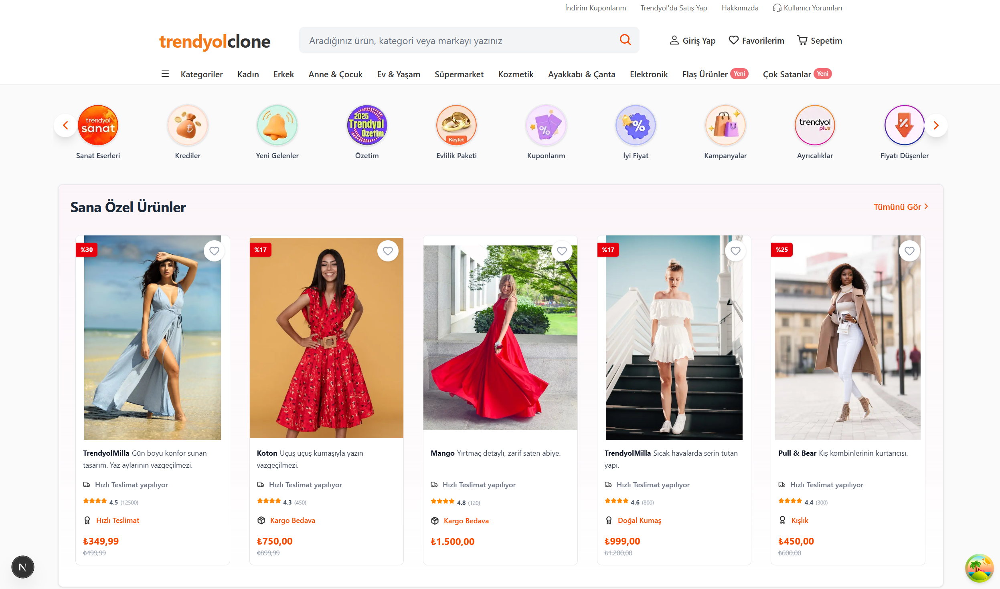

# 🛒 Trendyol Clone - Next-Generation E-Commerce



<div align="center">


<br/>

[](https://nextjs.org/)
[](https://react.dev/)
[](https://firebase.google.com/)
[](https://tailwindcss.com/)
[](https://tanstack.com/query/latest)

</div>

<p align="center">
  <strong>Türkiye'nin en büyük e-ticaret platformunun modern web teknolojileri ve bulut tabanlı kimlik doğrulama sistemleri ile geliştirilmiş, yüksek performanslı klonu.</strong>
</p>

<p align="center">
  <a href="#-özellikler">Özellikler</a> •
  <a href="#-teknoloji-yığını">Teknoloji Yığını</a> •
  <a href="#-kurulum">Kurulum</a> •
  <a href="#-proje-mimarisi">Mimari</a>
</p>

---

## 🚀 Proje Hakkında

Bu proje, modern frontend mimarisi ve **Clean Architecture** prensipleri gözetilerek geliştirilmiştir. **Next.js 16 (App Router)** altyapısı üzerine inşa edilen uygulama, **Firebase Authentication** ile güvenli kullanıcı yönetimi sağlar.

Sadece bir arayüz kopyası değil; e-posta doğrulama, arama geçmişi yönetimi, dinamik varyant algılama algoritmaları ve gelişmiş filtreleme sistemleri ile tam teşekküllü bir e-ticaret simülasyonudur.

## ✨ Özellikler

### 🔐 Kimlik Doğrulama & Güvenlik (Firebase)

- **Giriş & Kayıt:** Email/Şifre ile güvenli kullanıcı girişi.
- **Email Doğrulama:** Kayıt olan kullanıcılara otomatik doğrulama e-postası gönderimi.
- **Oturum Yönetimi:** Kullanıcı durumunun (Session) uygulama genelinde korunması.

### 🛍️ Alışveriş Deneyimi

- **Akıllı Arama Sistemi:** LocalStorage tabanlı, geçmişi hatırlayan ve silinebilir arama motoru.
- **Dinamik Varyant Algoritması:** Ürün tipine göre (Teknoloji için "GB", Giyim için "Beden", Market için "Litre") otomatik etiketleme yapan akıllı UI.
- **Sepet Yönetimi:** Persistent (kalıcı) sepet yapısı, anlık fiyat güncellemesi.

### 🎨 Modern UI/UX

- **Tailwind CSS v4:** Yeni nesil CSS motoru ile ultra hızlı stil derleme.
- **Responsive Tasarım:** Mobil öncelıklı (Mobile-First) yaklaşım.
- **Animasyonlar:** Sayfa geçişleri ve mikro etkileşimler.

### ⚙️ Teknik Yetenekler

- **Server State:** **TanStack Query** ile verilerin önbelleklenmesi ve senkronizasyonu.
- **Form Validasyonu:** **Formik** ve **Yup** ile güvenli form yapıları.
- **SEO:** Dinamik metadata ve Open Graph etiketleri.

## 🛠 Teknoloji Yığını

Projede endüstri standardı ve en güncel paketler kullanılmıştır:

### Çekirdek (Core)

- **Framework:** Next.js 16.1 (App Router)
- **Dil:** TypeScript
- **Kütüphane:** React 19.2

### Backend & Auth

- **Auth Provider:** Firebase Authentication (v12)
- **Mock API:** JSON Server

### Stil & UI

- **Styling:** Tailwind CSS v4, Tailwind Merge, CLSX
- **Komponentler:** Radix UI (Dialog, Dropdown, Tabs, Accordion)
- **İkonlar:** Lucide React, React Icons
- **Carousel:** Embla Carousel, React Multi Carousel
- **Bildirimler:** React Toastify

### State & Form

- **State Management:** TanStack Query v5 & Context API
- **Form:** Formik & Yup
- **Utils:** Cookies-next, React Credit Cards 2

## 💻 Kurulum

Projeyi yerel ortamınızda çalıştırmak için aşağıdaki adımları izleyin:

1. **Repoyu klonlayın:**
   ```bash
   git clone [https://github.com/okhanali/TrendyolClone.git](https://github.com/okhanali/TrendyolClone.git)
   cd trendyol-clone
   ```
